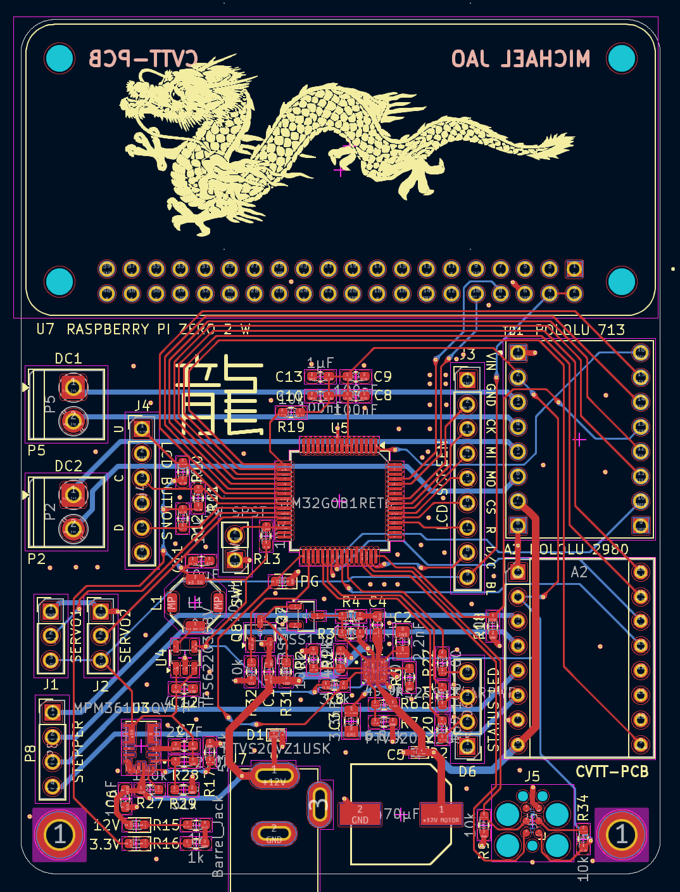
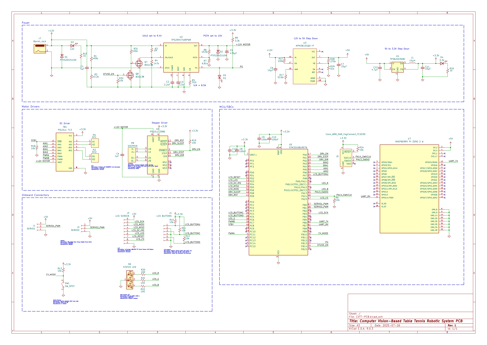

# CVTT-PCB
**Custom Embedded PCB for a Computer Vision-Based Table Tennis Robotic System**

  
  
  

<em>The dragon on the silkscreen references Ma Long, the goat of table tennis; 'Long' translates to 'dragon' in Mandarin.</em>

## Core Components

- **Microcontrollers and Compute:**
  - STM32G0B1RET6
  - Raspberry Pi Zero 2 W

## Actuation System

- **Motor Driver Support:**
  - 2 Brushless DC motors for flywheels
  - 2 Servos for direction and distance control
  - 1 Stepper motor for ball feeding

## Power and Regulation

- **Power Circuitry:**
  - 12V input
  - E-fuse circuit
  - 12V to 5V LDO Regulator
  - 5V to 3.3V LDO Regulator

## User Interface

- **Controls and Feedback:**
  - Manual/CV mode switch
  - LCD screen for manual control
  - LCD navigation buttons
  - Diagnostic LEDs
 
## Next Steps
- Programming STM machine logic state machine
- Programming RPI CV player recognition algorithm
- Motor selection and power calculations for eFuse ILM
